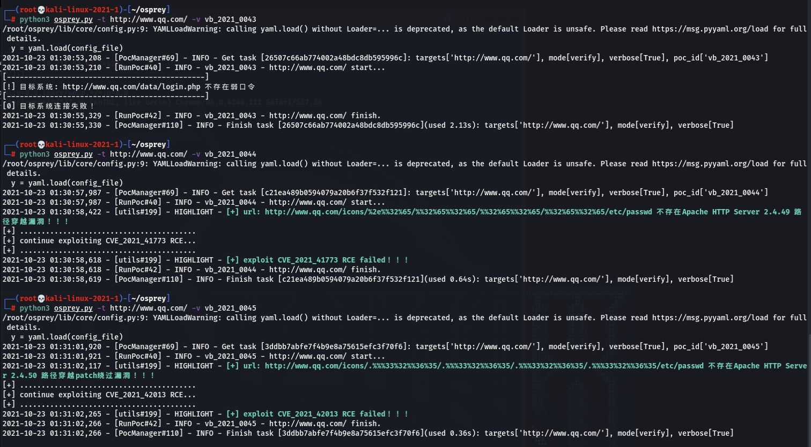

# fierce-fish  [](https://www.python.org/)

fierce-fish是由TCC(斗象能力中心)出品并维护的开源漏洞检测框架osprey的改写，去掉臃肿功能的精简版本poc框架

 - PS：真的用不惯其它臃肿的功能，不过作为一个收集漏洞poc && exp的框架还是非常不错的！！！

 - [osprey](https://github.com/TophantTechnology/osprey)

 - For beginners friendly (script kiddos would like it !)

### 简介

fierce-fish ------ 凶鱼，一种比鱼鹰还要凶猛的鱼，由于是osprey的改写版所以取此命名漏洞盒子PoC框架，寓意快，精，准，凶。

fierce-fish 是一个可无限扩展自定义poc的开源漏洞检测与利用框架(Python3开发)，是osprey的修改版。 fierce-fish框架可供使用者在渗透测试、漏洞检测、漏洞扫描等场景中应用。框架提供了命令行接口，可供灵活调用，也可用于构建自己的扫描器, 构建自己的通用型漏洞库。

***持续添加POC && EXP***

### 安装

从Git上获取最新版本的osprey代码

``` bash
$ git clone https://github.com/FDlucifer/firece-fish.git
$ cd firece-fish
$ pip3 install -r requirements.txt
```

 - 若执行脚本还是报错，可以根据报错信息提示缺失的模块，手动执行命令(pip3 install ‘缺失模块名')，进行安装...

### 使用

- 获取帮助列表：

``` bash
$ python osprey.py --help
```

- 最简单的用法，针对一个目标URL，发起一个PoC做检测：

``` bash
$ python osprey.py -t URL -v POC_ID
```

### 目前已收录漏洞POC及EXP

漏洞名|poc名称|poc链接
---|:--:|---:
Metinfo 5.3.17 X-Rewrite-url SQL Injection|vb_2017_0060|[Metinfo_5_3_17_X_Rewrite_url_Sql_Injection](pocs/vb_2017_0060_Metinfo_5_3_17_X_Rewrite_url_Sql_Injection.py)
Landray-OA Arbitrary File Read|vb_2021_0001|[Landray-OA Arbitrary File Read](pocs/vb_2021_0001_Landray_OA_Arbitrary_File_Read.py)
Yy-OA A6 Disclosure of sensitive information|vb_2021_0002|[Yy-OA A6 Disclosure of sensitive information](pocs/vb_2021_0002_Yy-OA_Disclosure_of_sensitive_information.py)
LionfishCMS ApiController.class.php SQL Injection|vb_2021_0003|[LionfishCMS ApiController.class.php SQL Injection](pocs/vb_2021_0003_LionfishCMS_ApiController_class_php_SQL_Injection.py)
LionfishCMS ApigoodsController.class.php SQL Injection|vb_2021_0004|[LionfishCMS ApigoodsController.class.php SQL Injection](pocs/vb_2021_0004_LionfishCMS_ApigoodsController_class_php_SQL_Injection.py)
Kingsoft V8 Arbitrary file read|vb_2021_0005|[Kingsoft V8 Arbitrary file read](pocs/vb_2021_0005_Kingsoft_V8_Arbitrary_file_read.py)
Kingsoft V8 pdf_maker.php RCE|vb_2021_0006|[Kingsoft V8 pdf_maker.php RCE](pocs/vb_2021_0006_Kingsoft_V8_pdf_maker_RCE.py)
Kingsoft V8 Default Weak Password|vb_2021_0007|[Kingsoft V8 Default Weak Password](pocs/vb_2021_0007_Kingsoft_V8_Default_Weak_Password.py)
Weaver OA 8 SQL injection|vb_2021_0008|[Weaver OA 8 SQL injection](pocs/vb_2021_0008_Weaver_OA_8_SQL_Injection.py)
Weaver OA Bsh RCE|vb_2021_0009|[Weaver OA Bsh RCE](pocs/vb_2021_0009_Weaver_OA_Bsh_RCE.py)
Citrix XenMobile Read FIle|vb_2021_0010|[Citrix XenMobile Read FIle](pocs/vb_2021_0010_Citrix%20XenMobile_file_read.py)
Weblogic RCE CVE-2020-14882|vb_2021_0011|[Weblogic RCE CVE-2020-14882](pocs/vb_2021_0011_Weblogic_RCE_CVE_2020_14882.py)
Hanming Video Conferencing File Read|vb_2021_0012|[Hanming Video Conferencing File Read](pocs/vb_2021_0012_Hanming_Video_Conferencing_file_Read.py)
Jinher OA Arbitrary File Read|vb_2021_0013|[Jinher OA Arbitrary File Read](pocs/vb_2021_0013_Jinher_OA_Arbitrary_File_Read.py)
LanProxy Server Read File|vb_2021_0014|[LanProxy Server Read File](pocs/vb_2021_0014_LanProxy_file_read.py)
YApi Remote Code Execute|vb_2021_0015|[YApi Remote Code Execute](pocs/vb_2021_0015_yapi_rce.py)
SaltStack RCE CVE-2020-11651|vb_2021_0016|[SaltStack RCE CVE-2020-11651](pocs/vb_2021_0016_saltstack_rce_cve_2020_11651.py)
Coremail Server Information Leakage|vb_2021_0017|[Coremail Server Information Leakage](pocs/vb_2021_0017_Coremail_Server_Information_Leakage.py)
AonarQube Api Information Leakage|vb_2021_0018|[AonarQube Api Information Leakage](pocs/vb_2021_0018_SonarQuber_Api_Information_Leakage.py)
Alibaba Canal Accesskey Information Leakage|vb_2021_0019|[Alibaba Canal Accesskey Information Leakage](pocs/vb_2021_0019_Alibaba_Canal_AccessKey_Information_Leakage.py)
MessageSolution Email System Information Leakage|vb_2021_0020|[MessageSolution Email System Information Leakage](pocs/vb_2021_0020_MessageSolution_Email_System_Information_Leakage.py)
ICEFlow VPN Information Leakage|vb_2021_0021|[ICEFlow VPN Information Leakage](pocs/vb_2021_0021_ICEFlow_VPN_Information_Leakage.py)
IceWarp WebClient Basic RCE|vb_2021_0022|[IceWarp WebClient Basic RCE](pocs/vb_2021_0022_IceWarp_WebClient_Basic_RCE.py)
ShowDoc File Upload|vb_2021_0023|[ShowDoc File Upload](pocs/vb_2021_0023_ShowDoc_File_Upload.py)
Duoke-Web-Server-SQLInjection|vb_2021_0024|[Duoke-Web-Server-SQLInjection](pocs/vb_2021_0024_DuokeWebServer.py)
yonyou-UFIDA-NC-file-read|vb_2021_0025|[yonyou-UFIDA-NC-file-read](pocs/vb_2021_0025_yonyou_ERP-NC_File_reading.py)
zhongqingnabo_information_leak|vb_2021_0026|[zhongqingnabo_information_leak](pocs/vb_2021_0026_zhongqingnabo.py)
Apache Druid RCE|vb_2021_0027|[Apache Druid RCE](pocs/vb_2021_0027_Apache_Durid_RCE_CVE_2021_25646.py)
Apache Kylin Xielou ReadFile|vb_2021_0028|[Apache Kylin Xielou ReadFile](pocs/vb_2021_0028_Apache%20Kylin_xielou.py)
Apache Flink Read File|vb_2021_0029|[Apache Flink Read File](pocs/vb_2021_0029_Apache%20Flink%20_file_read.py)
Apache Flink Rce|vb_2021_0030|[Apache Flink Rce](pocs/vb_2021_0030_Apache%20Flink%20_RCE.py)
3C HG659 Lib An Arbitrary FileRead|vb_2021_0031|[3C HG659 Lib An Arbitrary FileRead](pocs/vb_2021_0031_H3C_HG659_Lib_An_Arbitrary_File_Read.py)
IceWarp WebClient Basic RCE|vb_2021_0032|[IceWarp WebClient Basic RCE](pocs/vb_2021_0032_IceWarp_WebClient_Basic_RCE.py)
亿赛通命令执行漏洞|vb_2021_0033|[亿赛通命令执行漏洞](pocs/vb_2021_0033-AtlassianJira_Information_Leakage.py)
Atlassian Jira Information disclosure|vb_2021_0034|[Atlassian Jira Information disclosure](pocs/vb_2021_0034-YiSaiTong_RCE.py)
LANLING OA file read|vb_2021_0035|[LANLING OA file read](pocs/vb_2021_0035_OA_fileread.py)
CISCO Read-Only Path Traversal Vuln|vb_2021_0036|[CISCO Read-Only Path Traversal Vuln](pocs/vb_2021_0036_CISCO_Arbitrary_File_Read.py)
Seeyon_Ajax_Getshell|vb_2021_0037|[Seeyon_Ajax_Getshell](pocs/vb_2021_0037_Seeyon_Ajax_Getshell.py)
待补充|vb_2021_0038|[待补充]()
待补充|vb_2021_0039|[待补充]()
待补充|vb_2021_0040|[待补充]()
待补充|vb_2021_0041|[待补充]()
zyxel_nbg2105_bypass_auth|vb_2021_0042|[zyxel_nbg2105_bypass_auth](pocs/vb_2021_0042_zyxel_nbg2105_bypass_auth.py)
HIKVISION_file_read|vb_2021_0043|[HIKVISION_file_read](pocs/vb_2021_0043_HIKVISION_file_read.py)
CVE_2021_41773_poc_and_exploit|vb_2021_0044|[CVE_2021_41773_poc_and_exploit](pocs/vb_2021_0044_CVE_2021_41773_poc_and_exploit.py)
CVE_2021_42013_poc_and_exploit|vb_2021_0045|[CVE_2021_42013_poc_and_exploit](pocs/vb_2021_0045_CVE_2021_42013_poc_and_exp.py)
CVE_2021_38647_omigod_RCE|vb_2021_0046|[CVE_2021_42013_poc_and_exploit](pocs/vb_2021_0046_cve_2021_38647_omigod.py)

### 特点

 1. 体积小
 - 
 2. 检测效果精准，可自己持续按照框架模版添加poc, 方便高效
 - 

### poc编写说明相关文档

基于[Osprey](https://github.com/TophantTechnology/osprey/)编写PoC，请参考 [osprey编写规范和要求说明](doc/PoC_specification.md)

### 后续会在本仓库长期更新最新的POC & EXP。:)